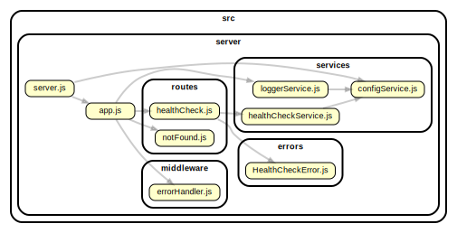

# Express Api Template

A starter template for express with:

- Handlers for 404 and health checks
- tests written in jest and supertest
- with eslint and prettier pre-configured
- almost zero babel use; babel is used to transform tests for jest but all server code is transformed via esm 

See `engine` field in `package.json` for minimum `node`/`npm` requirements.




## Developer commands

### Install

```shell script
npm run ci
```

### Run the api

For dev
```shell script
npm run start:dev
```

For production
```shell script
npm run start
```

### Code hygiene
```shell-script
npm run lint # eslint
npm run format # prettier
```

### Tests

Run once
```shell-script
npm run test
```

```shell-script
npm run test:watch
```

### CI commands

There is a `Dockerfile` supplied that can be run using make. Additionally, CI tasks can be run using Github Actions. 
Both can be tested using the `Makefile`. For running github action workflows locally, [act](https://github.com/nektos/act) is required to be 
installed.

```shell-script
make build # build the docker image
````

```shell-script
make run # run the docker image
```

```shell-script
make gha_build # run the build workflow
````

```shell script
make gha_pull_request # Run the pull_request event
```

```shell-script
make gha_list # list workflows
```

## Example Requests

[](https://app.getpostman.com/run-collection/803a965000e4d2f53e55)

- `/health-check` - health check endpoint
    - returns 200 if service is healthy or 503 if service is sick


